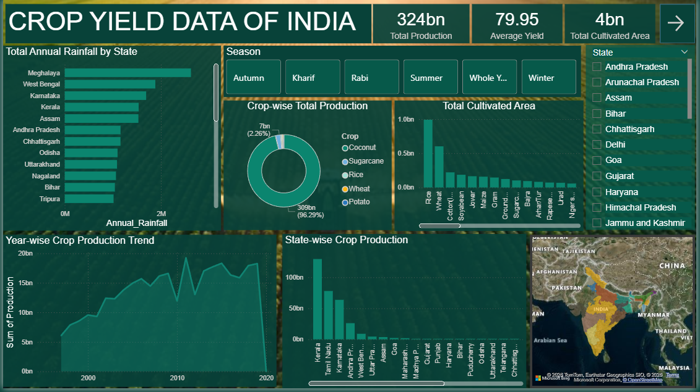
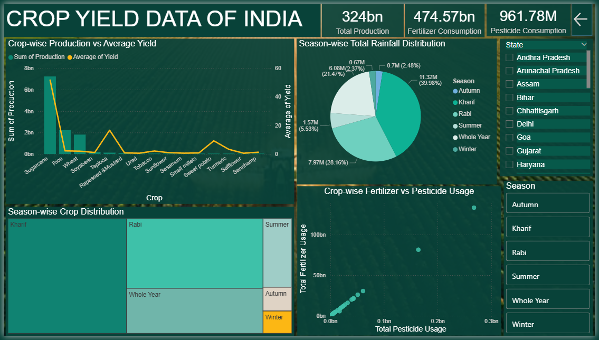

# Crop Yield and Productivity in India – Power BI Dashboard

## Project Overview
This project analyzes crop yield and agricultural productivity across Indian states using Power BI.  
It focuses on the impact of rainfall, seasonality, cultivated area, fertilizer usage, and pesticide usage.

## Objectives
- Analyze crop production across Indian states
- Study seasonal variation in crop yield
- Examine the role of rainfall in agriculture
- Understand the relationship between fertilizer and pesticide usage

## Data Details
- **Type:** Secondary agricultural data  
- **Coverage:** India (State-wise)  
- **Time Period:** 1997 – 2020  

## Tools Used
- Power BI (Dashboard Development)
- DAX (Measures & Calculated Columns)
- MS Excel (Data Cleaning & Preprocessing)
- Data Visualization & Insights

## Key Insights
- Kharif season contributes the highest crop production
- Rainfall significantly impacts crop yield
- Rice and wheat dominate cultivated area
- Coconut shows high yield efficiency
- Fertilizer and pesticide usage are positively related

## Dashboard Overview

## Author
**Arya V**  
Data Analyst Trainee | Camerinfolks Pvt. Ltd
